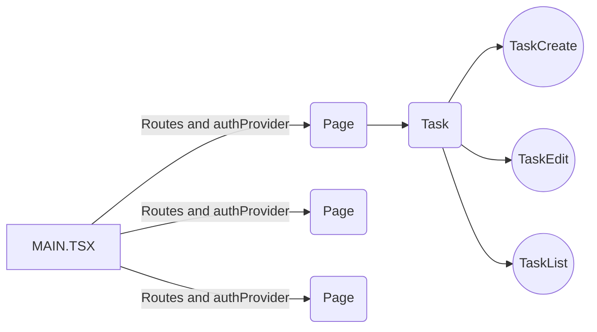

# Welcome to TODO Client!

Hi, I'm making this app to train my skills with code. Try to code an entire app with simple and maintainable code. 
Technologies that i'm using: 
React 
TypeScript 
StyledComponents 
Axios 

# Instructions

To use this app, you must need:  
Node (16x) 
Yarn or NPM 
And a device to run everthing 😁 

First: 
Run this script in app root folder : "yarn" to install all deps 
Nice, if everything looks good, run "yarn dev" to run the app 

**Resume** 
1°: yarn 
2°: yarn dev  

**IMPORTANT: THIS CLIENT NEED A BACKEND SERVICE**
This is the backend: 
https://github.com/GabrielCampos99/todo-server

## Structure

