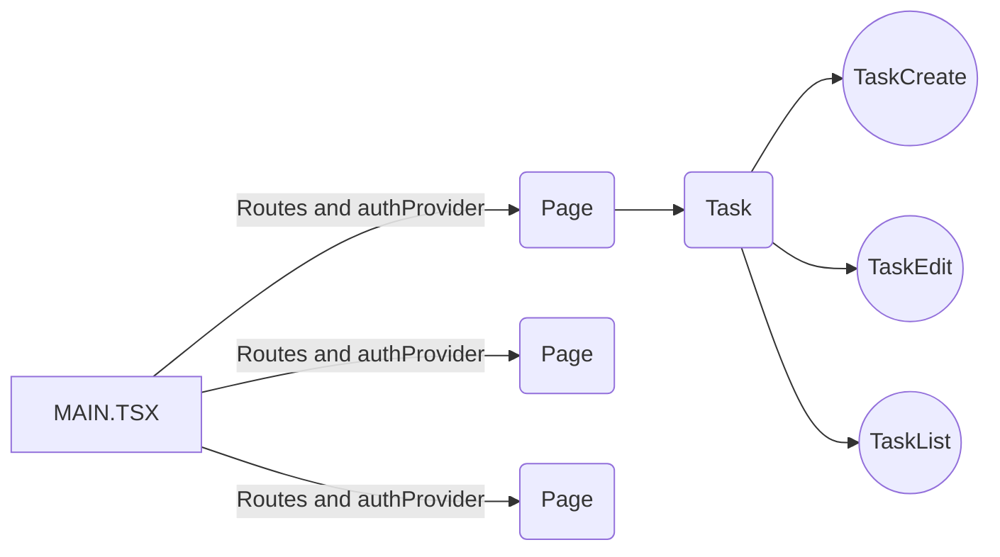

# Welcome to TODO Cliente!

Hi, I'm making this app to train my skills with code. Try to code a entire app with simple and maintainable code.
Technologies that i'm using:
React
TypeScript
StyledComponents
Axios

# Instructions

To use this app, you must need: 
Node (16x)
Yarn or NPM
And a device to run everthing 😁

First:
Run this script in app root folder : "yarn" to install all deps
Nice, if everything looks good, run "yarn dev" to run the app

**Resume**
1°: yarn
2°: yarn dev 

**IMPORTANT: THIS CLIENT NEED A BACKEND SERVICE**
This is the backend: https://github.com/GabrielCampos99/todo-server

## Structure

